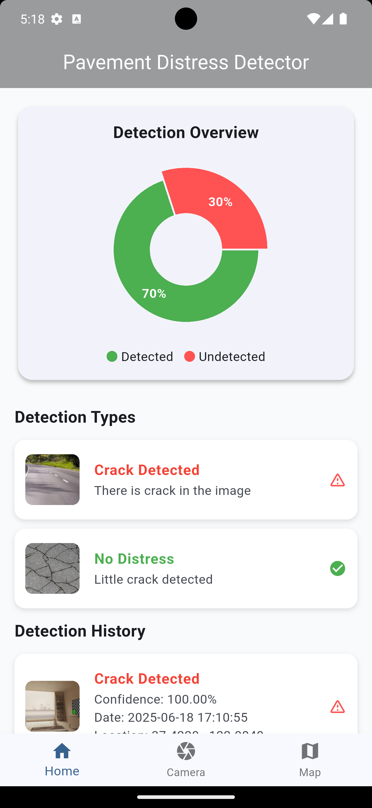
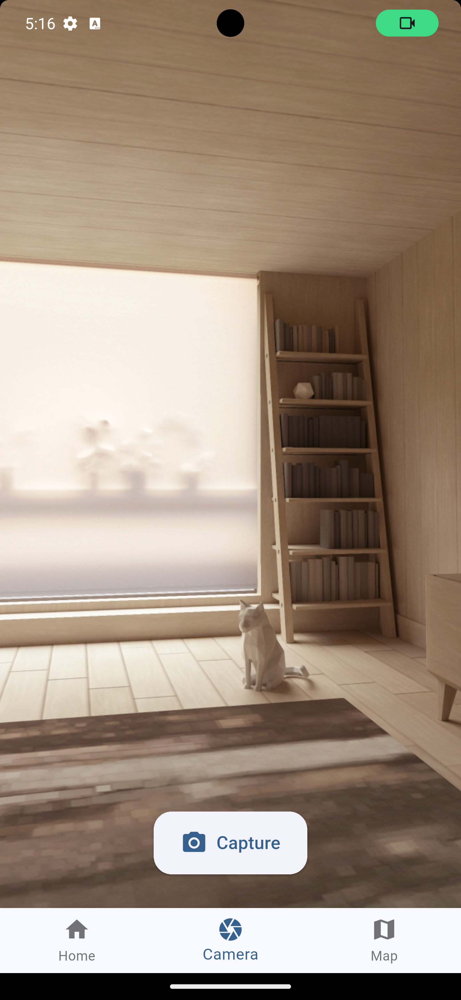
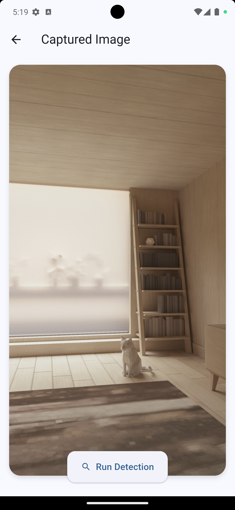
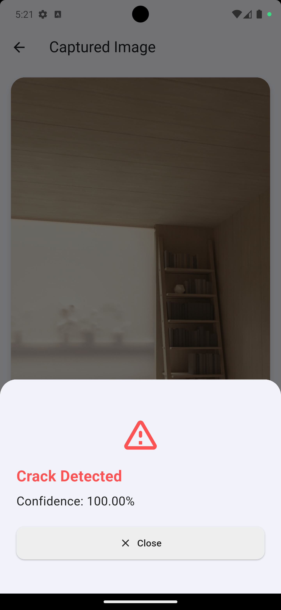
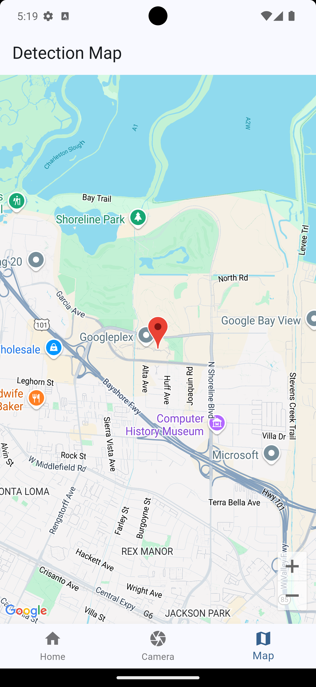

# 🛣️ AI-Based Pavement Distress Detection App

An AI-powered mobile application designed to detect pavement cracks and other road surface distress using a TensorFlow Lite model. This app integrates real-time detection, GPS mapping, and historical logging to assist road engineers and municipalities in maintaining road infrastructure efficiently.

    

## 📱 Built With

- **Frontend**: Flutter
- **AI Model**: TensorFlow Lite (CNN for crack detection)
- **Backend**: FastAPI (for user data, detection logs, analytics)
- **Map Integration**: Google Maps SDK
- **State Management**: Riverpod (Flutter)
- **Image Processing**: `image` package in Dart
- **Other Tools**: OpenCV (preprocessing), Geolocator, Camera, File Picker

---

## ✨ Features

- 📷 Capture or upload road images
- 🧠 Detect pavement distress using a CNN model
- 📍 Get current GPS location of detection
- 🧾 Log detection history with label, confidence, date/time, and coordinates
- 🌍 Visualize past detections on Google Maps
- 📤 Admin dashboard (in progress) for centralized review
- 📊 Real-time and historical analytics (upcoming)

---

## 🧠 AI Model Info

- **Model**: TensorFlow Lite
- **Input**: Grayscale / RGB images resized to model input shape (e.g., 224x224)
- **Output**: Distress label (e.g., Crack, Pothole) with confidence score
- **Preprocessing**: Image resized, normalized, and reshaped into model format

---

## 📂 Project Structure

```
lib/
│
├── main.dart
├── app.dart
├── features/
│   ├── detection/
│   │   ├── domain/
│   │   │   └── entities/
│   │   │           └── detection_entry.dart
│   │   ├── data/
│   │   └── presentation/
│   ├       └── pages
│   ├       │     └── camera_screen.dart
│   ├       │     └── captured_image_screen.dart
│   ├       │     └── home_screen.dart
│   ├       │     └── map_screen.dart
│   ├       │     └── welcome_screen.dart
│   ├       └── providers
│   ├             └── camera_provider.dart
│   ├             └── detection_history_provider.dart
│   │
│   ├── core/
│
│
├── images/
│   └── crack.jpeg
│   └── non cracked.jpeg
│
assets/
├── models/
│   └── cnn_crack_detector.tflite
```

---

## 📸 Detection Workflow

1. User captures or selects an image
2. Image is preprocessed and passed to the TensorFlow Lite model
3. Model returns prediction (`label`, `confidence`)
4. GPS location and timestamp are fetched
5. Results are displayed in a BottomSheet with an icon and stored in state
6. Optionally visualized on a map or submitted to the backend

---

## 🚀 Getting Started

### 1. Clone the Repository

```bash
git clone https://github.com/chi2785443/pavement-distress-detector.git
send me a message send you the tflite file for the model used
cd pavement-distress-detector
```

### 2. Install Dependencies

```bash
flutter pub get
```

### 3. Configure Assets

Ensure `assets/models/cnn_crack_detector.tflite` exists and is declared in `pubspec.yaml`:

```yaml
flutter:
  assets:
    - assets/models/cnn_crack_detector.tflite
```

### 4. Add Google Maps API Key

Set your API key in `AndroidManifest.xml` and `AppDelegate.swift`.

### 5. Run the App

```bash
flutter run
```

---

## 🧪 Sample Detection Result

```json
{
  "label": "Crack",
  "confidence": 0.94,
  "timestamp": "2025-06-18T16:30:00Z",
  "latitude": 9.0578,
  "longitude": 7.4891
}
```

---

## 📌 State Management (Riverpod)

- `DetectionHistoryNotifier`: Holds the list of previous detections
- `detectionHistoryProvider`: Shared state across widgets
- Data stored includes `label`, `confidence`, `timestamp`, and optional GPS

---

## 🔒 Permissions Required

- Camera
- Location
- File System Access

Ensure to add necessary permissions in `AndroidManifest.xml` and `Info.plist`.

---

## 📊 Future Enhancements

- Admin analytics dashboard
- Model optimization (quantization/pruning)
- Fine-grained classification (e.g., transverse vs longitudinal cracks)
- Offline caching and export of logs

---

## 👨‍💻 Developer

**Chinedu Aguwa**
AI-Driven Civil Engineer | Full Stack Developer
📧 [neduaguwa443@gmail.com](mailto:neduaguwa443@gmail.com)
📞 +2348105471046
🔗 [LinkedIn](https://www.linkedin.com/in/chinedu-aguwa/) | [GitHub](https://github.com/chi2785443/)

---

## 🏷️ License

This project is licensed under the MIT License. See `LICENSE` file for details.

---
